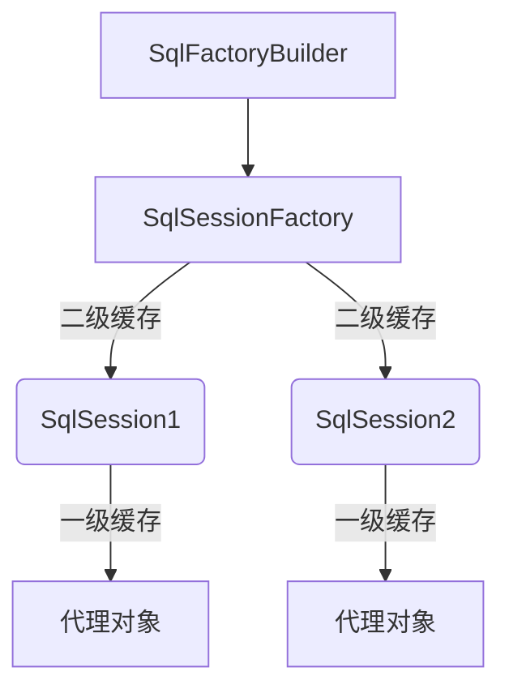

# mybatis学习笔记

### 概述

<span style="color:green">mybatis针对dao层的良好管理框架，传统的对于JDBC的操作繁琐冗余，mybatis通过映射配置文件的方式良好的管理JDBC驱动，还支持注解配置</span>

<hr>
### JDBC驱动

```java
import java.sql.DriverManager.*;
import org.junit.*;
/**
 *	传统的JDBC确实对数据库操作简单快捷， 但是我们在这个过程中所关注的重点应该是 那条SQL语句，而不是把时间都
 *	放在创建连接等的繁琐的事务上
 */
class Test{
    @Test
    public void test1(){
        //1.加载驱动程序
        Class.forName("com.mysql.jdbc.Driver");
        //2. 获得数据库连接
        Connection conn = DriverManager.getConnection(URL, USER, PASSWORD);
        //3.操作数据库，实现增删改查
        Statement stmt = conn.createStatement();
        //PrapareStatement pstmt = conn.prepareStatement(sql)
        ResultSet rs = stmt.executeQuery("SELECT user_name, age FROM table");
        //如果有数据，rs.next()返回true
        while(rs.next()){
            System.out.println(rs.getString("user_name")+" 年龄："+rs.getInt("age"));
        }
    }
}
```


### 环境构建

##### `log4j`

```properties
# Set root category priority to INFO and its only appender to CONSOLE.
#log4j.rootCategory=INFO, CONSOLE            debug   info   warn error fatal
log4j.rootCategory=debug, CONSOLE, LOGFILE

# Set the enterprise logger category to FATAL and its only appender to CONSOLE.
log4j.logger.org.apache.axis.enterprise=FATAL, CONSOLE

# CONSOLE is set to be a ConsoleAppender using a PatternLayout.
log4j.appender.CONSOLE=org.apache.log4j.ConsoleAppender
log4j.appender.CONSOLE.layout=org.apache.log4j.PatternLayout
log4j.appender.CONSOLE.layout.ConversionPattern=%d{ISO8601} %-6r [%15.15t] %-5p %30.30c %x - %m\n

# LOGFILE is set to be a File appender using a PatternLayout.
log4j.appender.LOGFILE=org.apache.log4j.FileAppender

log4j.appender.LOGFILE.File= D:/axis.log
log4j.appender.LOGFILE.Append=true
log4j.appender.LOGFILE.layout=org.apache.log4j.PatternLayout
log4j.appender.LOGFILE.layout.ConversionPattern=%d{ISO8601} %-6r [%15.15t] %-5p %30.30c %x - %m\n

```

##### `IUserDao.java`

```java
package org.mybati.dao;

import java.util.List;

//import org.apache.ibatis.annotations.Select;
import org.mybati.domain.User;

public interface IUserDao {
	/**
	 * 	查询所有
	 *  @return
	 */
	List<User> findAll();
}

```

##### `User.java`

| JavaBean(User)  | MySql   field |
| --------------- | ------------- |
| String username | username      |
| String address  | address       |
| id              | id            |

##### `主配置`

```xml
<configuration>
	<!-- url可以代替resource : file:///c/.../jdbcConfig.properties -->
	<properties resource="jdbcConfig.properties"></properties>

	<settings>
		<!-- 开启延迟加载 -->
		<setting name="lazyLoadingEnabled" value="true" />
	</settings>

	<!-- 指定 resultType="user" resultType="usEr"均可以 -->
	<typeAliases>
		<!-- <typeAlias type="org.mybati.domain.User" alias="user"/> -->
		<!-- 自动寻找package name 下面的JavaBean 类，自动起别名 -->
        <package name="org.mybati.domain" />
	</typeAliases>

	<!--default="MySQL"选中mysql环境-->
	<environments default="mysql">
        
		<environment id="mysql">
			<!-- 驱动管理 -->
			<transactionManager type="JDBC"></transactionManager>
			<!-- UNPOOLED：非连接池 -->
			<dataSource type="POOLED">
				<property name="driver" value="${jdbc.driver}" />
				<property name="url" value="${jdbc.url}" />
				<property name="username" value="${jdbc.username}" />
				<property name="password" value="${jdbc.password}" />
			</dataSource>
		</environment>
	</environments>

	<mappers>
		<!-- 映射配置文件，对于IUserDao 接口的代理实现
		<mapper class="org.mybati.dao.IUserDao"/> 
		<mapper resource="org/mybati/dao/IUserDao.xml"/> 
		-->
		<!-- 自动寻找目录下的配置文件 -->
         <!-- 前提条件是.xml文件与被代理方法名字相同 -->
		<package name="org.mybati.dao" />
	</mappers>
</configuration>
```

##### `映射配置`

```xml
    <!--
		mapper:
		详细位置在SqlConfiguration.mappers.mapper或者
		SqlConfiguration.mappers.package.name中已经限定好
	-->
<!DOCTYPE mapper
        PUBLIC "-//mybatis.org//DTD Mapper 3.0//EN"
        "http://mybatis.org/dtd/mybatis-3-mapper.dtd">
<mapper namespace="全限定类名">
	<!--sql语句-->
    <!--id="接口中的相关的方法名"-->
    <!--resultType="查询到的数据库包装成Bean(User)"-->
    <!--在主配置文件中已经启用了别名机制，所以不用谢实体类的全类名-->
    <select id="findAll" resultType="Bean">
    	select * from user
    </select>
</mapper>
```

##### `测试`

```java
//  读取配置文件
InputStream is = Resources.getResourceAsStream("SqlConfig.xml");

//  建造一个用来创建SqlSession的工厂 -->建造者模式
SqlSessionFactoryBuilder factoryBuilder = new SqlSessionFactoryBuilder();
//  工厂模式
SqlSessionFactory factory = factoryBuilder.build(is);
//  得到session
SqlSession session = factory.openSession();

//  获取userDao的代理对象userDao -->动态代理
IUserDao userDao = session.getMapper(IUserDao.class);

List<User> users = userDao.findAll();
for (User user : users) {
    System.out.println(user);
}
session.close();
assert is != null;
is.close();
```

### 自定义mybatis

<hr>


#### 原理分析


#### 代码梳理

`D:/mawenshu/dev/workspace/JavaEE/02-mybatis`

<hr>


### 增删改查

```xml
<?xml version="1.0" encoding="UTF-8"?>
<!DOCTYPE mapper
        PUBLIC "-//mybatis.org//DTD Mapper 3.0//EN"
        "http://mybatis.org/dtd/mybatis-3-mapper.dtd">
<!-- namespace 指定为哪一个接口配置mapper -->
<mapper namespace="mawenshu.dao.IUserDao">
    <!-- 对应IUserDao接口中的insert方法 -->
    <!-- 参数类型 -->
    <insert id="insert" parameterType="mawenshu.domain.User">
        <!-- 
		insert 时采用主键自增的策略，新增之前id = null,我们期望可以获得新增后的user的id的值，可以通过如下方式获得 
-->
        <selectKey keyProperty="id" keyColumn="id" resultType="int" order="AFTER">
            select last_insert_id()
        </selectKey>
        insert into user(username, password, birth)
        values (#{username}, #{password}, #{birth})
    </insert>

    <delete id="deleteById" parameterType="int">
        DELETE FROM user
        WHERE id = #{id}
    </delete>

    <update id="update" parameterType="mawenshu.domain.User">
        update user
        set username = #{username}, password = #{password}, birth = #{birth}
        where id = #{id}
    </update>

    <!-- 结果集封装类型 -->
    <select id="findById" parameterType="int" resultType="mawenshu.domain.User">
        SELECT * FROM user WHERE id = #{id}
    </select>
    
    
    <!-- 方法1
      #{word} 中的word实际上随便写什么都是可以的，只是一个占位的
      这条语句实际上是得到了PrepareStatement的声明，可以放置SQL注入
       Preparing: SELECT * FROM user WHERE password LIKE ?
      调用: findByWord("%张%")  *注意是 %张%
 -->
    <select id="findByWord" parameterType="String" resultType="mawenshu.domain.User">
        SELECT * FROM user WHERE password LIKE  #{word}
    </select>
    
    <!--
		方法2,实际上SQL语句为：
		SELECT * FROM user WHERE password like '%u%'，这种方式存sql注入的风险
		-->
    <select>
        SELECT * FROM user WHERE password like '%${word}%'
    </select>
    
    <!-- 方法3 -->
    <select>
    	SELECT * FROM user WHERE password like concat('%', #{word}, '%') 
    </select>
</mapper>

```

**OGNL**语法

```` tex
OGNL: Object Graphic Navicate Language

在类中我们可以通过  user.getName() 的方式获得属性值 name
那么OGNL中，我们可以通过 #{name} 来获得属性值 name
大概的流程如下：
	user.getName --> #{user.getName} --> #{user.Name} --> #{user.name}
	
<insert id="insert" parameterType="mawenshu.domain.User">
        insert into user(username, password, birth)
        values (#{username}, #{password}, #{birth})
</insert>	
所以在上述相关语句的标签中有 #{username}，实际上就是 #{user.username} --> #{user.getUsername}
但是在 parameterType已经有了user的限定，所以有 #{username}

综上 OGNL 表达式实际上取得的值是通过 属性 name 的getter 函数来取值的
	再如
	Condition 封装了user对象
	
    <select id="findByBean" parameterType="mawenshu.config.Condition" resultType="mawenshu.domain.User">
        SELECT * FROM user WHERE username = #{user.username}
    </select>
````


### 动态SQL语句

```xml
<select id="findByCondition" parameterType="user" resultType="user">
    SELECT * FROM user
    <!-- WHERE 1 = 1 -->
    // where 语句
    <where>
        <!-- test 中的username 是Java 类中属性中username-->
        //	在java 层面先行判断
        <if test="username = '马文澍'">
            //	查询数据库的具体条件 --> where username = "mawenshu"
            username = #{username}
        </if>
    </where>

</select>

<select id="findInIds" parameterType="condition" resultType="user">
    SELECT * FROM user
    <!--    WHERE id IN (id1, id2, id3)   -->
    <where>
        <if test="ids != null and ids.size()>0">
            //	遍历ids, open开头, close结尾, item代表遍历出来的每个元素, 
            //	#{id}将其填充到prepareStatement的占位符中
            <foreach collection="ids" open="id in (" close=")" item="id" separator=",">
                #{id}
            </foreach>
        </if>
    </where>
</select>
```


<hr>


### 多表连接查询

**mysql相关知识**

```mysql
两条语句等价，两个表的某条记录没有相对应的话，就不会连接  -->内连接
-- select * from user, account
-- select * from user inner join account
有主副表之分， left outer join 以左表为主表，指无论无何，左表记录都会存在
-- select * from user left outer join account on user.id = account.user_id
-- create table user_role(
-- 	user_id int NOT NULL,
-- 	role_id int NOT NULL,
-- 	CONSTRAINT `ur_u_id` FOREIGN KEY (user_id) REFERENCES user(id),
-- 	CONSTRAINT `ur_r_id` FOREIGN KEY (role_id) REFERENCES role(id)
-- )
-- select user.*, role.*from user 
-- inner join user_role on user.id = user_role.user_id
-- INNER JOIN role on user_role.role_id = role.id

-- select user.*, role.*from user 
-- left outer join user_role on user.id = user_role.user_id
将筛选好的表再次作为主表，进行左外连接
-- left outer join role on user_role.role_id = role.id
```

#### 实体类准备

```tex
使用三个实体类来体现三个表之间的关系
class User{}
class Account{}
class Role{}

User类的属性
	Integer id
	...
	List<Account> accounts;
	List<Role> roles;

Account类的属性
	Integer id
	...
	User user
	
Role类的属性
	Integer id
	...
	List<User> users;
```


#### 对一查询

```xml
<resultMap id="accountWithUser" type="account">
    <id property="id" column="id"/>
    <result property="accountName" column="account_name"/>
    <result property="balance" column="balance"/>
    <result property="updateTime" column="update_time"/>
    <result property="userId" column="user_id"/>
	// column 可以省略 , ----> 连接user的外键
    <association property="user" column="user_id">
        //	①
        <id property="id" column="id"/>
        <result property="username" column="username"/>
        <result property="password" column="password"/>
        <result property="birth" column="birth"/>
    </association>
</resultMap>

<!-- 一对一  -->
<!-- resultType 已经不能满足简单的银蛇关系了，这个时候可以使用resultMap手动指定映射规则 -->
<select id="findAllWithUser" resultMap="accountWithUser">
    select account.*, user.* from account
    left outer join user on user.id = account.user_id
</select>
```

```tex
在对一查询封装中，我们可以不用关注id 字段的冲突，不用起别名来映射实体类的 属性 与数据库表的 列 的对应关系,
当然可以起别名
select account.*, user.id as uid, user.username, user.password, user.birth from account
left outer join user on user.id = account.user_id

这时①处改为<id property="id" column="uid"/>
```

#### 对多查询

```xml
<resultMap id="rolesWithUsers" type="role">
    <id property="id" column="rid"/>
    <result property="name" column="name"/>

    <collection property="users" ofType="user">
        <id property="id" column="id"/>
        <result property="username" column="username"/>
        <result property="password" column="password"/>
        <result property="birth" column="birth"/>
    </collection>
</resultMap>
<select id="findAllWithUsers" resultMap="rolesWithUsers">
    -- 这里必须起别名避免冲突，否则封装到链表中的数据只会有一个
    select user.*, role.id as rid, role.name from user
    left outer join user_role on user.id = user_role.user_id
    left outer join role on user_role.role_id = role.id
</select>
```

<hr>


### 延迟加载      		

```xml
<resultMap type="userAccount" id="loadingMap">
    <id property="id" column="id" />
    <result property="username" column="username" />
    <result property="address" column="address" />
    <result property="sex" column="sex" />
    <result property="birthday" column="birthday" />
    <!-- 需要延迟加载的属性user(accounts) -->
    <!-- 通过什么去加载:user(id) -->
    <!-- 加载的sql语句 -->
    <association property="accounts" column="id"
                 select="org.mybati.dao.IUserDao.lazyLoading">
    </association>
</resultMap>

<select id="lazyLoading" parameterType="INT"
        resultType="account">
    select *
    from account where uid = #{id}
</select>

<select id="findAll" resultMap="loadingMap">
    select * from user
</select>
```


<hr>


### 缓存





​																																							[回到顶部](# mybatis学习笔记\(eclipse\))


