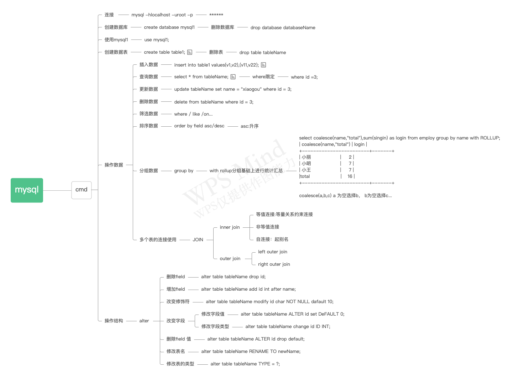

## 思维导图概览



## 3范式

```properties
1NF: 列不可再分
2NF: 消除部份依赖
3NF: 消除传递依赖
```

## 创建表

**数据类型**

```properties
varchar(255): 可变长字符串，根据实际的数据长度动态分配空间
char(255): 定长字符串，定长分配空间
int(11): 整型 int
bigint: 长整形 long
float: 单精度
double: 双精度
date: 日期
datetime: 日期时间
clob: 字符大对象 --> 4G Character Large OBject
blob: 二进制大对象-->图片等
```

## 快速复制

```sh
create table table_name1 as select * from table_name2
```

## 删除表

```sh
drop table if exist table_name;
```

## 约束

### 非空约束

**not null**

### 唯一约束

```sh
# 联合约束 ？✖︎
create table tableName（
	name varchar（20）unique，# 列级约束写法
	age varchar（20）unique
）
# 表示的是各自分别唯一约束

# 联合约束 ？✓
create table tableName（
	name varchar（20，
	age varchar（20），
	unique（name， age）# 表级约束写法
）
```

### 主健约束

```sh
主健约束

create table aaa(
	id int primary key # 单一主键
)

# 复合主键
create table aaa(
	id int，
	name varchar（20），
	primary key(id, name)
)

# 一张表主健约束只能是一个

1、自然主键（常用）
2、业务主键
```

### 外健约束

```mysql
外健依赖于主键值
父子 子父

fatherTable id
create table sonTable（
	id int，
	fatherId int，
	foreign key（fatherId） references fatherTable(id)
）
```

## 存储引擎

```tex
数据的存储/组织方式
show create table tableName；

...
()
ENGINE= InnoDB ...

create table tableName（
	...
）ENGINE = InnoDB default charset=utf8

创建表的时候添加存储引擎
默认的存储引擎是InnoDB，字符编码是utf8


MyISAM：
	格式文件：存储表的结构 .frm
	数据文件：存储表的记录 .myd
	索引文件：存储表的索引 .myi
	对于一张表， 只要有主键或者unique约束， 会自动创建索引
	
InnoDB：
	支持事物，数据奔溃可以恢复，安全，但是效率不高，不能压缩
	格式文件：存储表的结构 .frm
	索引文件/数据文件：tablespace

MEMEORY：
	存储在内存中，断电就无了
```

## 表连接

### 内连接

**等值链接：等量关系**

```sh
# 92：表的连接和筛选条件杂糅
mysql> select tele, book.*  from author, book where book.aid = author.id;
# 99：表链接条件独立， 筛选条件继续添加where即可， inner可以省略
mysql> select tele, book.*  from author inner join book on book.aid = author.id where id = 1 sand ...
```

**非等值连接:非等量关系**

```sh
select 
	e.name, s.grade
from 
	emp e
inner join
	sal s
on 
e.sal between s.low and s.high
```

**自连接**

```sh
# 一张表emp 看成两张表a/b
select 
	a.name, b.name 
from 
	emp a
inner join 
	emp b
on a.leader_id = b.id
```

### 外链接

**左外连接**：以左表为主表， 连接右表， 左表字段始终显示

**右外连接**： 与左外连接相反

## 子查询

嵌套select语句

```sh
select
	...(select) # 只能返回一条记录
from
	...(select) # 可以讲子查询的结果当成一张临时表 起别名
where
 	...(select)
```

**找出每个岗位的平均工资及其工资的等级**

```sh
# 找出每个岗位的平均工资（临时表t）
select job, avg(sal) from emp group by job  
# 工资等级表 salgrade
select * from salgrade
# 
select
	t.*, s.level
from 
	(select job, avg(sal) as avgsal from emp group by job) as t
join 
	salgrade s
on 
	t.avgsal between s.low and s.high
```

**找出每个员工的部门名称，显示员工名，部门名**

```sh
select 
	e.name, 
	(select d.name from dept d where d.deptno = e.deptno) # 1⃣️
	as dname
from 
	emp e
	
#	1⃣️ 期望只能查出来1条记录
```

## 合并

```sh
select * from a
union
select * from b

# a有10条记录， b有38条记录， 则匹配次数为10 + 38 = 48次
# 如果用连接的话， 则匹配次数为 10*38 = 380次
```

## 分页

**limit**

```sh
limit start, length
#	按照薪资降序，取出前五个
select ename, sal
from emp
order by emp.sal desc
limit 0,5
# 参数： 页数pageNo， 记录数pageSize
#（pageNo-1）* pageSize-->start
```

## 事务

只有与**DML**相关
数据库中一个事务可以理解为多条DML语句同时成功， 或者同时失败

**InnoDB**引擎中有一个**事务性活动日志文件**

**事务开始 **insert/update/... **事务结束**
**事务提交**：持久化经过操作的数据到数据库中
**事务回滚**：撤销操作，清楚事物活动日志文件， 回滚到上一次的提交点

```mysql
# mysql中事务默认自动提交
# 开启事务
start transaction;

insert into tableName values();

update tableName set name = ''

# 回滚
rollback;

#	提交
commit;
```

**事务的四大特性**

```TEX
原子性：  事务不可再分割
持久性:   事务提交后数据应该提交到硬盘存储
一致性:   数据操作整个过程守恒
隔离性： 事务之间相互独立
```

**四种隔离级别**

```properties
READ UNCOMMITTED: 读未提交
脏读 : 一个事务读到了另一个事务未提交的数据

READ COMMITTED: 读已提交  -> Oracle
不可重复读 : 在一个事务内， 两次读到的数据不一致

REPEATED READ: 可重复读
幻读 :　幻读是事务非独立执行时发生的一种现象。例如事务T1对一个表中所有的行的某个数据项做了从“1”修改为“2”的操作，这时事务T2又对这个表中插入了一行数据，而这个数据的数值还是为“1”并且提交给数据库。而操作事务T1的用户如果再查看刚刚修改的数据，会发现还有一行没有修改，其实这行是从事务T2中添加的，就好像产生幻觉一样，这就是发生了幻读

SERIALIZABLE:  串行化锁表， 排队加锁

T1修改数据未提交 ， T2读取到这个数据， T1回滚。 T2读到的数据自然是假的-->脏读

T1修改数据未提交 ， T2读取这个数据发现未发生变化， T1提交数据， T2读取数据发现数据发生变化
对T2来说，在同一个事务内， 两次读取到的数据不一致 -->虚读(不可重复读)

T1修改数据未提交， T2修改数据并提交， T1提交数据，T1查看数据发现有一条记录数据未修改 --> 幻读
```

## 索引

索引依附于表的某个字段，为了提高查询效率

主键/唯一约束(mysql)上自动添加索引

**单一索引**/**复合索引**/**主键索引**/**唯一性索引**

**索引语法**

```mysql
# 创建索引
create index indexName on tableName(fieldName)
# 删除索引
create index indexName on tableName
```

**SQL**是否使用了索引进行检索

**explain ** sql --> type = ref

**索引失效**

```mysql
1、模糊查询中以%开头
select * from table_name where name like '%T'

2、使用 or， 只有一侧有索引，则失效  name有索引，但是job没有索引
select * from table_name where name = 'kim' or job = 'aaa'

3、复合索引， 没有使用左侧的列查询
create index index_name on table_name(job, sal);
select * from table_name where sal = 100

4、索引列参加了数学运算
select * from table_name where sal + 1 = 100

5、在where中索引列使用了函数
select * from table-name where lower(name) = 'zhangsan'

6、隐式的类型转换早场索引失效
```

## 视图

view：**站在不同的角度看待同一份数据**

对视图的增删改查会导致原表数据发生变化 ， 可以将多个表联合创建一个视图

**创建视图**  create view view-name as select * from ... where ...

**删除视图**  drop view view-name

**更新视图**  update view-name set a = 'a' ...

**查询视图**  select * from view-name were

**作用**

```properties
1、封装了查询好的sql语句， 简化CRUD（Retrieve ）
2、权限控制（屏蔽敏感字段）
```

## DBA命令

**创建一个用户：**create user username IDENTIFIED BY 'PASSWORD'

**授权：**GRANT ALL PRIVILEDGES on db-name.table-name to 'username'

**回收权限：**REVOKE ... ...

**数据导出**：mysqldump db-name > D:db-name.sql -uroot -p ppp

**导入：**1、登陆，2、创建数据库，3、使用这个数据库，4、source D：db-name.sql

