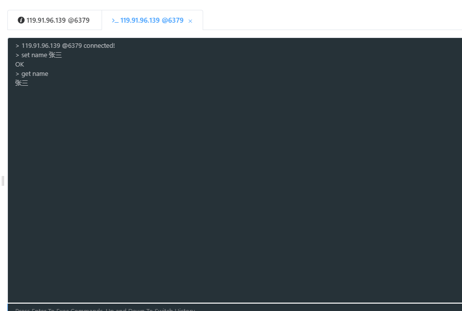
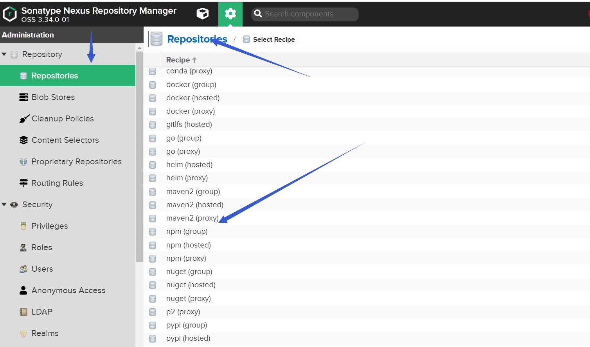

## 安装docker

```shell
# centOs内核版本
> uname -r
3.10.0-1160.36.2.el7.x86_64

# 安装
> yum install docker

# 查看docker 版本
> docker -v
Docker version 1.13.1, build 7d71120/1.13.1

# 启动 docker
> systemctl start docker
 
# 设置开机自启动
systemctl enable docker
> Created symlink from /etc/systemd/system/multi-user.target.wants/docker.service to /usr/lib/systemd/system/docker.service.


# 查看docker 默认镜像源
cat /etc/docker/daemon.json
{}

# 配置docker 镜像源
vim /etc/docker/daemon.json
# 配置内容
{
        "registry-mirrors":["https://m90kac7x.mirror.aliyuncs.com"]
}
# 从aliyun 账号获得，这里用的我的账号的
```

 **目前未设置开机自启动**


**设置开机自启动**


**docker.service**


**镜像配置完成**


## docker 安装redis

```sh
# 查询可用的redis镜像
docker search redis
# 拉取redis镜像
docker pull reids:tag #tag => version，不指定tag，默认最新版本
docker pull redis:latest
```

**查看已经拉取的redis镜像**


```sh
# 创建一个卷
docker volume create my-vol
# 列出所有卷
docker volume ls
# 监视卷
docker volume inspect my-vol
# 移除卷
docker volume rm my-vol
# 使用镜像nginx:latest创建一个容器devtest并且指定卷myvol2映射容器内部/app 
docker run -d  --name devtest  -v myvol2:/app  nginx:latest
# 验证卷是否被正确创建和安装
docker inspect devtest
#停止容器， 移除卷
docker container stop devtest
docker container rm devtest
docker volume rm myvol2
```

### **创建redis容器(简单创建，可选)**

```sh
docker run --name redis6 -p 6379:6379 -v redis-data:/data -d redis:latest

#查看已经创建的容器
docker ps
```


```sh
# 查看所有容器， 包括未启动的容器
docker ps -a
```

```sh
# 进入容器内部
docker exec -it redis6 /bin/bas
# 启动脚手架测试
redis-cli

linux内部redis搭建成功

#删除容器
docker stop redis6
docker rm redis6
```

### 创建redis容器(挂载数据卷)

##### 1、创建目录 

```sh
/usr/local/docker/volumes/redis
该目录下再创建 data和config两个目录。用来挂载映射redis容器中的数据
```

##### 2、官网下载个redis.conf文件，放进conf目录


##### 3、修改配置文件redis.conf


###### **注释掉69行的bind,以便外部访问**


###### **protected-mode 属性设为no**


###### **设置redis密码以便安全**


###### **重新创建一个redis容器**

```sh
docker run -p 6379:6379 
-v /usr/local/docker/volumes/redis/conf/redis.conf:/usr/local/etc/redis/redis.conf 
-v /usr/local/docker/volumes/redis/data:/data 
--name redis6 -d redis:latest 
redis-server /usr/local/etc/redis/redis.conf --appendonly yes


-v: # 表示挂在路径， 即外部文件与容器内部文件意义映射
--appendonly yes：# 表示redis开启持久化策略
```


**防火墙开放6379端口**

```sh
firewall-cmd --zone=public --add-port=6379/tcp --permanent
# 更新防火墙规则 
firewall-cmd --reload
```

**防火墙配置命令**

```json
启动一个服务：systemctl start firewalld.service
关闭一个服务：systemctl stop firewalld.service
重启一个服务：systemctl restart firewalld.service
显示一个服务的状态：systemctl status firewalld.service
在开机时启用一个服务：systemctl enable firewalld.service
在开机时禁用一个服务：systemctl disable firewalld.service
查看服务是否开机启动：systemctl is-enabled firewalld.service
查看已启动的服务列表：systemctl list-unit-files|grep enabled
查看启动失败的服务列表：systemctl --failed

配置firewalld-cmd

查看版本： firewall-cmd --version
查看帮助： firewall-cmd --help
显示状态： firewall-cmd --state
查看所有打开的端口： firewall-cmd --zone=public --list-ports
更新防火墙规则： firewall-cmd --reload
查看区域信息: firewall-cmd --get-active-zones
查看指定接口所属区域： firewall-cmd --get-zone-of-interface=eth0
拒绝所有包：firewall-cmd --panic-on
取消拒绝状态： firewall-cmd --panic-off
查看是否拒绝： firewall-cmd --query-panic
```


**测试链接**




## 安装nexus

**使用docker-compose安装更加快捷**

### **安装docker-compose**

```sh
yum install epel-release 
# EPEL的全称叫 Extra Packages for Enterprise Linux 。EPEL是由 Fedora 社区打造，为 RHEL 及衍生发行版如 CentOS、Scientific Linux 等提供高质量软件包的项目。装上了 EPEL之后，就相当于添加了一个第三方源。

# 安装dnf包管理工具
yum install dnf
# DNF(Dandified Yum)是新一代的RPM软件包管理器。

dnf install docker-compose
# Compose 是用于定义和运行多容器 Docker 应用程序的工具
```

### **使用docker-compose安装nexus**

```sh
# 创建一个目录用于挂载nexus3的数据文件
dir = /usr/local/docker/volumes/nexus/nexus-data

# 配置对nexus-data读写执行的权限
chmod 777 /usr/local/docker/volumes/nexus/nexus-data
```

##### **创建docker-compose.yml脚本**

```yaml
version: '3'
services: 
 nexus3:
  image: sonatype/nexus3
  container_name: nexus3
  restart: always
  ports:
   - 8081:8081
  volumes:
   - /usr/local/docker/volumes/nexus/nexus-data:/nexus-data 
   # ${dir}:/nexus-data
```

```sh
# 启动， 注意要在docker-compose.yml当前所在目录执行下面命令
docker-compose up -d 
```

**开放8081端口**

```sh
firewall-cmd --zone=public --add-port=8081/tcp --permanent

# 更新防火墙规则 
firewall-cmd --reload
```

**访问http://119.91.96.139:8081/**

## 私服配置

##### 默认仓库

```tex
maven-central：maven 中央库，默认从 https://repo1.maven.org/maven2/ 拉取 jar
maven-releases：私库发行版 jar，初次安装请将 Deployment policy 设置为 Allow redeploy
maven-snapshots：私库快照（调试版本）jar
maven-public：仓库分组，把上面三个仓库组合在一起对外提供服务，在本地 maven 基础配置 settings.xml 或项目 pom.xml 中使用
```

##### 仓库类型

```text
group：这是一个仓库聚合的概念，用户仓库地址选择 Group 的地址，即可访问 Group 中配置的，用于方便
开发人员自己设定的仓库。maven-public 就是一个 Group 类型的仓库，内部设置了多个仓库，访问顺序取决
于配置顺序，3.x 默认为 Releases、Snapshots、Central

hosted：私有仓库，内部项目的发布仓库，专门用来存储我们自己生成的 jar 文件
snapshots：本地项目的快照仓库
releases： 本地项目发布的正式版本
proxy：代理类型，从远程中央仓库中寻找数据的仓库（可以点击对应的仓库的 Configuration 页签下Remote Storage 属性的值即被代理的远程仓库的路径），如可配置阿里云 maven 仓库
central：中央仓库
```

##### **配置proxy仓库**




**release可重新发布**


##### **得到仓库访问入口地址**

http://119.91.96.139:8081/repository/maven-public/

##### **创建角色，并给角色授权(optional)**

##### **创建用户，并给用户授予某个角色**


##### **配置maven.setting.xml**

```xml
<servers>
    <server>
        <id>nexus-releases</id>
        <username>deploy</username>
        <password>deploy</password>
    </server>
    <server>
        <id>nexus-snapshots</id>
        <username>deploy</username>
        <password>deploy</password>
    </server>
</servers>
```

##### **配置向nexus推送**

**要部署的api不能有parent标签， 不然依赖报错（upload）**

```xml
<distributionManagement>
    <repository>
        <id>nexus-releases</id>
        <name>releases Repository</name>
        <url>http://119.91.96.139:8081/repository/maven-releases/</url>
    </repository>

    <snapshotRepository>
        <id>nexus-snapshots</id>
        <url>http://119.91.96.139:8081/repository/maven-snapshots/</url>
        <name>snapshots Repository</name>
    </snapshotRepository>
</distributionManagement>
```

##### **在 pom.xml 文件中配置新的仓库(download)**

```xml
<repositories>
    <repository>
        <id>maven-nexus</id>
        <name>maven-nexus</name>
        <url>http://192.168.0.129:8081/repository/maven-public/</url>
        <releases>
            <enabled>true</enabled>
        </releases>
        <snapshots>
            <enabled>true</enabled>
        </snapshots>
    </repository>
</repositories>

```

