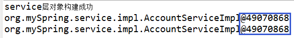
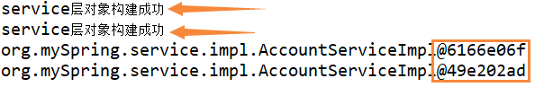
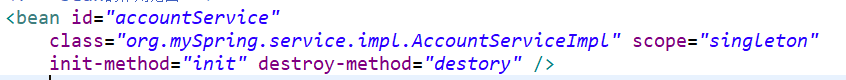
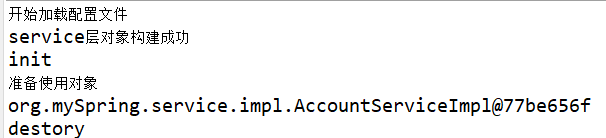
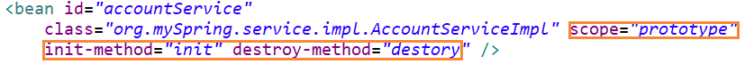
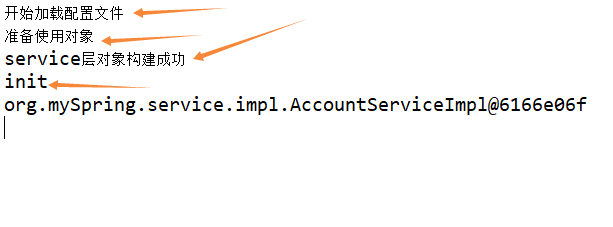

## spring

**java程序员的春天**

### 控制反转IOC

#### 创建bean

```properties
ioc:将创建bean的权利交给spring 容器管理， 包括两个步骤：

1、创建一个bean放到spring容器中， 2、注入使用这个bean
spring中可以使用xml的声明的方式在容器中创建一个bean
```

```properties
new 一个AccountService类型的bean,放到spring的容器中， 
```

```properties
可以使用工厂方法
类InstanceFactory中有一个产生类型为AccountService实例的bean
```

##### bean的作用范围

```java
scope="singleton"
单例的bean,bean会在加载配置文件bean.xml后立即创建
```



```java
scope="prototype"
多例的bean,即原型复制好多个bean,使用的时候才会创建bean
```



```java
others:session、request、global-sessio
    
global-session:
全局session，不同的服务器主机共享的会话
```

##### bean的生命周期

```java
System.out.println("开始加载配置文件...");
ClassPathXmlApplicationContext ac = new ClassPathXmlApplicationContext("Application.xml");

System.out.println("使用对象...");
UserService userService = ac.getBean("userService", UserService.class);
UserDao userDao = ac.getBean("userDao", UserDao.class);
ac.close();
```


**scope="singleton"**






**scope="prototype"**






`即使核心对象容器关闭了，也不会调用destory,这时采用**GC**机制`

#### 注入使用

##### 构造函数注入

**(写死，不经改变，不灵活，很难满足多变需求)**

##### setter注入

##### 特殊类型数据注入


其中**map**中也可以写为：

```xml
<entry key="gender">
	<value>男</value>
</entry>
```

<font color="red">上面红色框之间可以相互交换</font>
<font color="greem">上面绿色框之间可以相互交换</font>

#### 注解简化开发
使用某些注解标注某个类， 表示将这个类放入了bean容器
**全局配置**
```xml
<?xml version="1.0" encoding="UTF-8"?>
<beans xmlns="http://www.springframework.org/schema/beans"
       xmlns:xsi="http://www.w3.org/2001/XMLSchema-instance"
       xmlns:context="http://www.springframework.org/schema/context"
       xsi:schemaLocation="http://www.springframework.org/schema/beans
        http://www.springframework.org/schema/beans/spring-beans.xsd
        http://www.springframework.org/schema/context
        http://www.springframework.org/schema/context/spring-context.xsd">
    <!--可以扫描到的包 -->
	<context:component-scan base-package="mySpring"></context:component-scan>
</beans>
```
**使用注解创建Bean**
```properties
@Component:表示这是spring容器中的一个Bean组件
  - @Service: service层专用， 功能类似@Component
  - @Controller: controller层专用，功能类似@Component
  - @Repository: Repository层专用，功能类似@Component
```
**使用注解注入bean**
```properties
@Autowired :按照类型注入Bean
@Qualifier("id"): 按照id注入Bean
@Resource(name="id")

@Value("string"):基础数据类型和String类型的单值注入
```

### 面向切面AOP

解决代码臃肿冗余，复用性不高，模块之间耦合度高

#### 初步解决方法

将大量重复使用的代码块抽取成一个个的方法，降低代码冗余，但是这解决不了根本性的问题，即代码的耦合度没有降低，如果需求变了，那么我们肯定是要修改源代码，如果代码庞大，这种重复性的修改无疑做着无用功，所以AOP思想诞生了

#### AOP思想

首先**AOP**是基于*动态代理*的思想，在不改变原有类(*被代理类)*的前提下，创建新生的类*(代理类)*来增强原有的类
起名叫AOP呢，形象的说，AOP思想是将需求代码块插入原有类

#### AOP原理-动态代理
##### jdk 

**接口**

```java
package proxy;

public interface IProducer {
    void saleService(Float money);
}
```

**实现接口**

```java
package proxy.impl;

import proxy.IProducer;

public class Producer implements IProducer {
    @Override
    public void saleService(Float money) {
        System.out.println("一台电脑出售成功，售价:" + money);
    }
}
```

**代理类**

```java
// 原有对象
Producer producer = new Producer();
// 创建producer 的代理者
//	newProxyInstance(classLoader, Class, InvocationHandler(){})

Producer producer = (Producer)Proxy.newProxyInstance(producer.getClass().getClassLoader(), producer.getClass().getInterfaces(),
		new InvocationHandler() {
            @Override
            public Object invoke(Object proxy, Method method, Object[] args) throws Throwable {}
);

```

##### cglib 

**不必要求必须实现一个接口**

```java
//  被代理对象
Producer producer = new Producer();

Producer cglibProducer = (Producer) Enhancer.create(producer.getClass(), new MethodInterceptor() {
            @Override
            public Object intercept(Object o, Method method, Object[] args, MethodProxy methodProxy) throws Throwable {}
```

#### spring中使用AOP

##### xml

**依赖**

```xml
<dependency>
    <groupId>org.springframework</groupId>
    <artifactId>spring-aspects</artifactId>
    <version>5.1.6.RELEASE</version>
</dependency>
<dependency>
    <groupId>org.aspectj</groupId>
    <artifactId>aspectjweaver</artifactId>
    <version>1.9.6</version>
</dependency>
```

**application.xml**

```xml
<aop:config>
    <!--        配置切点	从哪儿切下去-->
    <aop:pointcut id="pt" expression="execution(* mawenshu.dao.*.*(..))"/>
    <!--        配置切面    要切入的东西， 增强的内容-->
    <aop:aspect id="accountAspect" ref="myAccountAspect">
        <aop:before method="beforeSave" pointcut-ref="pt"/>
        <aop:after-returning method="afterSave" pointcut-ref="pt"/>
        <aop:after-throwing method="exceptSave" pointcut-ref="pt"/>
        <aop:after method="finalSave" pointcut-ref="pt"/>
        <!--<aop:around method="aroundSave" pointcut-ref="pt"/>-->
    </aop:aspect>
</aop:config>
```

**切点类**

```java
@Repository
public class AccountDao {
    public void save(String info){
        System.out.println("保存成功,\ninfo = " + info);
//        int i = 1/0;
    }
}
```

**切面类**

```java
@Component
public class MyAccountAspect {
    public void beforeSave(JoinPoint joinPoint){
        System.out.println("$前置通知...");
    }
    public void afterSave(JoinPoint joinPoint){
        System.out.println("$后置通知...");
    }

    public void exceptSave(JoinPoint joinPoint){
        System.out.println("$异常通知...");
    }

    public void finalSave(){
        System.out.println("$最终通知...");
    }

    public Object aroundSave(ProceedingJoinPoint pjp) throws Throwable {
        System.out.println("环绕开始...");
        Object obj = null;
        try {
            System.out.println("$环绕:前置通知");
            obj = pjp.proceed();
            System.out.println("obj = " + obj);
            System.out.println("$环绕:后置通知");
        }catch (Throwable t){
            System.out.println("$环绕:异常通知");
            t.printStackTrace();
        }finally {
            System.out.println("$环绕:最终通知");
        }
        return obj;
    }
}

```

**测试类**

```java
public static void main(String[] args) {
        ApplicationContext ac = new ClassPathXmlApplicationContext("Application.xml");
        AccountDao accountDao = ac.getBean("accountDao", AccountDao.class);
        accountDao.save("mawenshu");
}
```

##### 注解开发

```xml
<aop:aspectj-autoproxy/>
```

**切面类**

```xml
@Component
@Aspect
public class MyAccountAspect {
    @Pointcut("execution(* mawenshu.dao.*.*()))")
    public void pt(){}

    @Pointcut("execution(* mawenshu.dao.*.*(..)))")
    public void pt2(){}

    @Before("pt()")
    public void beforeSave(JoinPoint joinPoint){
        System.out.println("$前置通知...");
    }

    @AfterReturning("pt()")
    public void afterSave(JoinPoint joinPoint){
        System.out.println("$后置通知...");
    }

    @AfterThrowing("pt()")
    public void exceptSave(JoinPoint joinPoint){
        System.out.println("$异常通知...");
    }

    @After("pt()")
    public void finalSave(){
        System.out.println("$最终通知...");
    }

    @Around("pt2()")
    public Object aroundSave(ProceedingJoinPoint pjp) throws Throwable {
        System.out.println("环绕开始...");
        Object obj = null;
        try {
            System.out.println("$环绕:前置通知");
            obj = pjp.proceed();
            System.out.println("obj = " + obj);
            System.out.println("$环绕:后置通知");
        }catch (Throwable t){
            System.out.println("$环绕:异常通知");
            t.printStackTrace();
        }finally {
            System.out.println("$环绕:最终通知");

        }
        return obj;
    }
}
```

#### 事务管理

```xml
<dependency>
    <groupId>org.springframework</groupId>
    <artifactId>spring-tx</artifactId>
    <version>5.1.6.RELEASE</version>
</dependency>
```

##### xml

不使用事务

```java
// 出现异常 A减钱的而B没有加钱
public void trans(String A, String B, Float account){
    //        A减钱
    String sql1 = "update account set balance = balance - ? where name = ?";
    jdbcTemplate.update(sql1, account, A);
    // 出现异常 A减钱的而B没有加钱
    //        int i=1/0;出现异常

    //        B加钱
    String sql2 = "update account set balance = balance + ? where name = ?";
    jdbcTemplate.update(sql2, account, B);
}

/**
   <bean id="datasource" class="com.alibaba.druid.pool.DruidDataSource">
        <property name="driverClassName" value="com.mysql.jdbc.Driver"/>
        <property name="url" value="jdbc:mysql://localhost:3306/mws_account"/>
        <property name="username" value="root"/>
        <property name="password" value="123456"/>
    </bean>

    <bean id="jdbcTemplate" class="org.springframework.jdbc.core.JdbcTemplate">
        <property name="dataSource" ref="datasource"/>
    </bean>
 */
```

**使用事务**
当程序出现异常时，事务回滚

```xml
<?xml version="1.0" encoding="UTF-8"?>
<beans xmlns="http://www.springframework.org/schema/beans"
       xmlns:xsi="http://www.w3.org/2001/XMLSchema-instance"
       xmlns:context="http://www.springframework.org/schema/context"
       xmlns:aop="http://www.springframework.org/schema/aop"
       xmlns:tx="http://www.springframework.org/schema/tx"
       xsi:schemaLocation="http://www.springframework.org/schema/beans
       http://www.springframework.org/schema/beans/spring-beans.xsd
       http://www.springframework.org/schema/aop
       http://www.springframework.org/schema/aop/spring-aop.xsd
       http://www.springframework.org/schema/tx
       http://www.springframework.org/schema/tx/spring-tx.xsd
       http://www.springframework.org/schema/context
       http://www.springframework.org/schema/context/spring-context.xsd">
    <context:component-scan base-package="mawenshu"/>
    <!--    <aop:aspectj-autoproxy/>-->
    // 数据源
    <bean id="datasource" class="com.alibaba.druid.pool.DruidDataSource">
        <property name="driverClassName" value="com.mysql.jdbc.Driver"/>
        <property name="url" value="jdbc:mysql://localhost:3306/mws_account"/>
        <property name="username" value="root"/>
        <property name="password" value="123456"/>
    </bean>

    <bean id="jdbcTemplate" class="org.springframework.jdbc.core.JdbcTemplate">
        <property name="dataSource" ref="datasource"/>
    </bean>

    <!--    添加数据源事务管理器-->
    <bean id="txManager" class="org.springframework.jdbc.datasource.DataSourceTransactionManager">
        <property name="dataSource" ref="datasource"/>
    </bean>
    <!--   配置事务的通知 -->
    <tx:advice id="myAdvice" transaction-manager="txManager">
        <!-- 配置事务的属性
                isolation：用于指定事务的隔离级别。默认值是DEFAULT，表示使用数据库的默认隔离级别。
                propagation：用于指定事务的传播行为。默认值是REQUIRED，表示一定会有事务，增删改的选择。查询方法可以选择SUPPORTS。
                read-only：用于指定事务是否只读。只有查询方法才能设置为true。默认值是false，表示读写。
                timeout：用于指定事务的超时时间，默认值是-1，表示永不超时。如果指定了数值，以秒为单位。
                rollback-for：用于指定一个异常，当产生该异常时，事务回滚，产生其他异常时，事务不回滚。没有默认值。表示任何异常都回滚。
                no-rollback-for：用于指定一个异常，当产生该异常时，事务不回滚，产生其他异常时事务回滚。没有默认值。表示任何异常都回滚。
        -->
        <tx:attributes>
            <tx:method name="*" propagation="REQUIRED" read-only="false"/>
            <tx:method name="find*" propagation="SUPPORTS" read-only="true"/>
        </tx:attributes>
    </tx:advice>
    <!--    编写aop让spring自动生成代理-->
    <aop:config>
        <aop:pointcut id="pt" expression="execution(* mawenshu.dao.*.*(..))"/>
        <!--        将切入点和事务的通知关联-->
        <aop:advisor advice-ref="myAdvice" pointcut-ref="pt"/>
    </aop:config>
</beans>

```

##### 注解开发

```xml
<!--    添加数据源事务管理器-->
<bean id="txManager" class="org.springframework.jdbc.datasource.DataSourceTransactionManager">
    <property name="dataSource" ref="datasource"/>
</bean>
<!--    为事务管理器注册管理驱动-->
<tx:annotation-driven transaction-manager="txManager"/>
```

添加事务

```java
/**
 * 加上 Transactional注解，表示该类受到spring事务的管理
 * 只对public相关的方法作用
 */
@Transactional(propagation = Propagation.SUPPORTS)
public class AccountDao {

    @Autowired
    JdbcTemplate jdbcTemplate;
    //此注解可以在类上面使用，也可以在方法上面注解，用于指定特例
    @Transactional(propagation = Propagation.REQUIRED)
    public void trans(String A, String B, Float account){...}
}
```

#### 事务管理-纯注解开发

**JdbcConfig**

```java
@PropertySource("jdbc.properties")
public class JdbcConfig {
    @Value("${jdbc.driver}")
    private String driver;
    @Value("${jdbc.url}")
    private String url;
    @Value("${jdbc.name}")
    private String name;
    @Value("${jdbc.password}")
    private String password;

    @Bean(name = "jdbcTemplate")
    public JdbcTemplate getJdbcTemplate(DataSource dataSource) {
        return new JdbcTemplate(dataSource);
    }

    @Bean(name = "dataSource")
    public DataSource getDataSource() {
        DruidDataSource druidDataSource = new DruidDataSource();
        druidDataSource.setDriverClassName(driver);
        druidDataSource.setUrl(url);
        druidDataSource.setUsername(name);
        druidDataSource.setPassword(password);
        return druidDataSource;
    }
}
```

**TransactionManagerConfig**
```java
import org.springframework.context.annotation.Bean;
import org.springframework.jdbc.datasource.DataSourceTransactionManager;
import org.springframework.transaction.PlatformTransactionManager;

import javax.sql.DataSource;

public class TransactionManagerConfig {
    @Bean(name = "transactionManager")
    public PlatformTransactionManager getTransactionManager(DataSource dataSource) {
        return new DataSourceTransactionManager(dataSource);
    }
}

```
**SpringConfig**
```java
@Configuration
@ComponentScan(basePackages = {"mawenshu"})
@Import({JdbcConfig.class, TransactionManagerConfig.class}) // 导入其他配置
@EnableTransactionManagement // 开启事务
public class SpringConfig {
}
```

**测试**
```java
ConfigurableApplicationContext ac = new AnnotationConfigApplicationContext(SpringConfig.class);
```