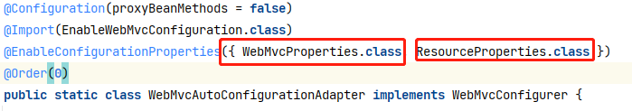

# springboot

**springboot是一个基于框架的框架，整合了springMVC 和spring**

## 入门

**环境**

```tex
MAVEN 3.6
IDEA2020
jdk1.8
springboot2.x.x
```

**依赖**

```xml
<parent>
    <groupId>org.springframework.boot</groupId>
    <artifactId>spring-boot-starter-parent</artifactId>
    <version>2.3.4.RELEASE</version>
    <relativePath/> <!-- lookup parent from repository -->
</parent>

<dependencies>
    <dependency>
        <groupId>org.springframework.boot</groupId>
        <artifactId>spring-boot-starter-web</artifactId>
    </dependency>
</dependencies>
```

**启动类创建**

```yaml
src:
 	# package-name必须有
	- package-name:
		- controller
		- entity
		- service
		- dao
	- MainApplication.java
```

**开启热部署**(快速重启)

```xml
<dependency>
    <groupId>org.springframework.boot</groupId>
    <artifactId>spring-boot-devtools</artifactId>
    <optional>true</optional>
</dependency>
```

+ 引入dev-tools 依赖
+ 设置idea
  + setting->compiler->勾选build project automatically
  + ctrl+alt+shift+/->register->compiler.automake.allow.when.app.running    √
+ ctrl+f9 restart

**运行启动类**

localhost:8080

## 基础

### 数据的属性配置

#### 属性映射

##### 组合一

**1、@ConfigurationProperties+@Component**

```java
/**
 * 	@Component 将该属性类放入IOC容器
 *  @ConfigurationProperties 加载配置文件指定的前缀属性数据
 * 	prefix="user1"    * 注意不要使用user,否则idea的会将IDEA用户user.name自动绑定
 */

@Data
@Component
@ConfigurationProperties(prefix = "user1")
public class UserProperties {
    private String name;
    private Integer age;
    private Boolean boss;
    private Date birth;
    private Map<String, Object> maps;
    private List<Object> lists;
    private Dog dog;
}
@Data
public class Dog {
    private String name;
    private Integer age;
}
```

**2、application.properties**

```properties
user1.name = 马文澍
user1.age = 22
user1.boss = false
user1.birth = 2020/12/02
user1.maps.k1 = v1
user1.maps.k2 = v2
user1.lists[0] = list1
user1.lists[1] = list2
user1.dog.name = 张三
user1.dog.age = 2
```

##### 组合二

**1、@ConfigurationProperties("acme")+@EnableConfigurationProperties(Pet.class)**

```java
package mawenshu.config;

import org.springframework.boot.context.properties.ConfigurationProperties;
import org.springframework.boot.context.properties.ConstructorBinding;

import java.net.InetAddress;
import java.util.List;

@Component //可以不加这个注解，但是IDEA bug爆红
@ConstructorBinding //采用构造器绑定
@ConfigurationProperties("acme")
public class AcmeProperties {} // AcmeProperties


package mawenshu;
@Configuration
@EnableConfigurationProperties(AcmeProperties.class)
public class Myconfig{}
```

**2、application.yml**

```yaml
acme:
  remote-address: 192.168.1.1
  security:
    username: admin
    password: 123456
    roles:
      - USER
      - ADMIN
```

##### 总结

**松散绑定语法 ** remote-address  => remoteAddress

**开启构造器绑定** @ConstructorBinding
**加载配置文件** @ConfigurationProperties("acme")  

**使用AcmeProperties** @EnableConfigurationProperties(AcmeProperties.class)

也可以在**启动类上标注要扫描的包** 

`@ConfigurationPropertiesScan(basePackages = "mawenshu.config")`

这表明mawenshu.config下面的构造器注入的配置类都会被扫描到，也解决了IDEA刚刚爆红的bug


#### 单值绑定

**1、@Value**

```java
@Data
@Component
public class UserProperties {
    @Value("${user1.name}")
    private String name;
    @Value("#{11*2+2}")
    private Integer age;
    @Value("${user1.boss}")
    private Boolean boss;
    private Date birth;
    private Map<String, Object> maps;
    private List<Object> lists;
    @Autowired
    private Dog dog;
}
```

**2、applications.yml**

```yaml
user1:
  name: 梅宇新
  age: 23
  boss: true
  birth: 2020/12/02
  maps:
    {
      status: true,
      message: 你好
    }
  lists:
    - 苹果
    - 柿子
  dog:
    name: *
    age: 3
```

#### 属性映射与单值绑定比较

**@Value和@ConfigurationProperties获取值比较**

|                      | @ConfigurationProperties | @Value     |
| -------------------- | ------------------------ | ---------- |
| 功能                 | 批量注入配置文件中的属性 | 一个个指定 |
| 松散绑定（松散语法） | 支持                     | 不支持     |
| SpEL                 | 不支持                   | 支持       |
| JSR303数据校验       | 支持                     | 不支持     |
| 复杂类型封装         | 支持                     | 不支持     |

配置文件yml还是properties他们都能获取到值；

如果说，我们只是在某个业务逻辑中需要获取一下配置文件中的某项值，使用@Value；

如果说，我们专门编写了一个JavaBean来和配置文件进行映射，我们就直接使用@ConfigurationProperties

```java
//	从数据库以指定格式取出
@JsonFormat(pattern = "yyyy-MM-dd", timezone = "GMT+8")
private Date birth;
//	接受指定的日期数据格式
@DateTimeFormat(pattern="yyyy-MM-dd")
```

## 自动配置原理

**常用注释**

```properties
@Configuration: 说明这是一个配置类(当然是一个组件)
@Import({Car.class}):将Car.class作为组件导入进来
@ImportResource("classpath:bean.xml")：加载原生xml文
@ConditionalOnBean(name={}): 当存在某个组件时才生效
```

**启动类**

```yaml
@SpringBootApplication:
	- @SpringBootConfiguration 
	- @EnableAutoConfiguration
	- @ComponentScan
```

## 整合Web开发

#### 自动配置类




#### 配置文件

**application.yml**

```yml
spring:
  # 两大配置都有
  mvc:
    async:
      request-timeout: 1000
  resources:
    static-locations:
      - classpath:/META-INF/resources/
      - classpath:/resources/
      - classpath:/static/
      - classpath:/public/
```

#### 配置原理总结

**如果动态资源位置路径与静态资源路径重复，则优先动态**

```java
@RequestMapping("a.jpg")
public String hello() {
    return "hello";
}
```

Web配置类 编码方式全部在这个接口 **WebMvcConfigurer**

```java
// WebMvcAutoConfigurationAdapter 已经过时
public class WebMvcConfig extends WebMvcConfigurerAdapter {
	//  已弃用 WebMvcConfigurerAdapter
}

// 直接实现 WebMvcConfigurer接口
@EnableConfigurationProperties({ WebMvcProperties.class, ResourceProperties.class })
public static class WebMvcAutoConfigurationAdapter implements WebMvcConfigurer {}
```

**这两个属性配置类，与application.properties绑定**

```java
@ConfigurationProperties(prefix = "spring.mvc")
public class WebMvcProperties {}

@ConfigurationProperties(prefix = "spring.resources", ignoreUnknownFields = false)
public class ResourceProperties {}
```

#### 表单支持RESTFUL

**表单提交格式**

```html
<form action="/user">
    <input type="submit" value="GET">
</form>
<form action="/user" method="post">
    <input type="submit" value="POST">
</form>
<form action="/user" method="post">
    <input type="hidden" name="_method" value="DELETE">
    <input type="submit" value="DELETE">
</form>

<form action="/user" method="post">
    <input type="hidden" name="_method" value="PUT">
    <input type="submit" value="PUT">
</form>
```

**原理**

```java
/** Default method parameter: {@code _method}. */
public static final String DEFAULT_METHOD_PARAM = "_method";

private String methodParam = DEFAULT_METHOD_PARAM;


@Override
protected void doFilterInternal(HttpServletRequest request, HttpServletResponse response, FilterChain filterChain)
    throws ServletException, IOException {

    HttpServletRequest requestToUse = request;

    if ("POST".equals(request.getMethod()) && request.getAttribute(WebUtils.ERROR_EXCEPTION_ATTRIBUTE) == null) {
        String paramValue = request.getParameter(this.methodParam);
        if (StringUtils.hasLength(paramValue)) {
            String method = paramValue.toUpperCase(Locale.ENGLISH);
            if (ALLOWED_METHODS.contains(method)) {
                requestToUse = new HttpMethodRequestWrapper(request, method);
            }
        }
    }

    filterChain.doFilter(requestToUse, response);
}
```

#### 模板引擎

##### Thymeleaf

###### 引入依赖

```xml
<parent>
    <groupId>org.springframework.boot</groupId>
    <artifactId>spring-boot-starter-parent</artifactId>
    <version>2.3.3.RELEASE</version>
</parent>
<dependencies>
    <dependency>
        <groupId>org.springframework.boot</groupId>
        <artifactId>spring-boot-starter-web</artifactId>
    </dependency>
    <dependency>
        <groupId>org.springframework.boot</groupId>
        <artifactId>spring-boot-starter-thymeleaf</artifactId>
    </dependency>
</dependencies>
```

注意是这个依赖`spring-boot-starter-thymeleaf`, 不是`thymeleaf`

###### 配置

```properties
spring.thymeleaf.prefix=classpath:/templates/ #默认配置
spring.thymeleaf.suffix=.html
spring.thymeleaf.encoding=UTF-8
#响应格式
spring.thymeleaf.servlet.content-type=text/html
#springboot	//	静态资源的位置指定
spring.resources.static-locations=classpath:/templates/,classpath:/static/
```

###### 语法用例

```html
<!DOCTYPE html>
<html lang="en" xmlns:th="http://www.thymeleaf.org">
<head>
    <meta charset="UTF-8">
    <title>INDEX</title>
</head>
<body>
<h1>thymeleaf 基本语法</h1>
<h2>展示单个数据</h2>
<span th:text="${student}"></span>
<span th:utext="${html}"></span>
<label>
    <input type="text" th:value="${student}">
</label>
<h2>展示对象数据</h2>
<table>
    <tr>
        <th>编号</th>
        <th>姓名</th>
        <th>生日</th>
    </tr>
    <tr>
        <td th:text="${user.id}"></td>
        <td th:text="${user.name}"></td>
        <td th:text="${#dates.format(user.bir, 'yyyy-MM-dd')}"></td>
    </tr>
</table>
<h2>展示集合(遍历数据)</h2>
<table>
    <tr>
        <th>编号</th>
        <th>姓名</th>
        <th>生日</th>
    </tr>
    <tr th:each="u, uStatus:${users}" >
        <span th:text="${uStatus.count}"></span>&nbsp;
        <span th:text="${uStatus.even}"></span>&nbsp;
        <span th:text="${uStatus.first}"></span>&nbsp;
        <span th:text="${uStatus.index}"></span>&nbsp;
        <span th:text="${uStatus.size}"></span><br>
        <td th:text="${u.id}"></td>
        <td th:text="${u.name}"></td>
        <td th:text="${#dates.format(u.bir,'yyyyMM-dd')}"></td>
    </tr>
</table>
</body>
</html>
```

`@{}`会获取到当前的项目名

`${}`取出request域中的对象(通常来说)

`#date`内置对象

###### 导入静态资源

```xml
<link rel="stylesheet" th:href="@{/css/index.css}">
<script th:src="@{/js/jquery.min.js}"></script>
```

###### 遗留问题

```markdown
method=post & @RequestParam
日期格式问题
forward:/A/B
```

###### 遗留问题(解决)

**1、日期格式问题**

**表单**

```html
<form action="/login" method="post">
    <label>
        <input type="text" name="username" value="马文澍">
    </label>
    ···
</form>
```

**控制层**

```java
@PostMapping("login")
public String login(Model model,
                    @RequestParam("username") String username,
                    @RequestParam("password") String password,
                    @DateTimeFormat(pattern = "yyyy-MM-dd") @RequestParam("birth") Date birth) {
    SimpleDateFormat sdf = new SimpleDateFormat("yyyy-MM-dd HH:mm:ss");
    System.out.println("格式化前:" + birth);
    System.out.println("格式化后:" + sdf.format(birth));

    User user = new User(username, password, birth);
    System.out.println("new birth = " + user.getBirth());
    model.addAttribute("user", user);
    return "success";
}
```

`@DateTimeFormat(pattern = "yyyy-MM-dd") @RequestParam("birth") Date birth`

thymeleaf自带format, `${#date.format(date, pattern)}`

**2、forward:/A/B**

`forward:/A/B` 中间不能有间隔