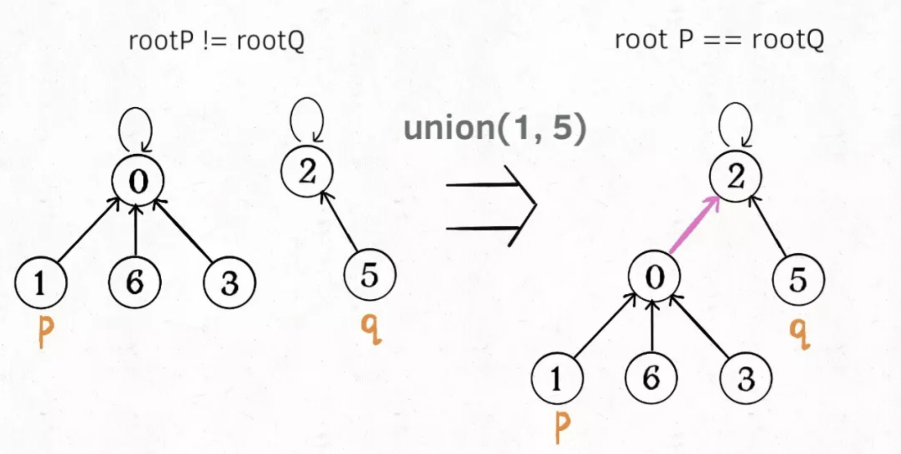

### 并查集

```java
class UF {
    /* 返回图中有多少个连通分量 */
    public int count();
  
    /* 树的每个节点都有一个指向父节点的指针， 如果该节点是根节点， 则父节点是自己   */
    // 节点 x 的父节点是parent[x] 
  	public int[] parent;
  
  	// 初始化并查集
  	public UF(int n){
      	this.count = n;
      	parent = new int[n];
      	for(int i =0; i< n; i++){
       			parent[i] = i;
      	}
    }
  
    /* 将 p 和 q 连接 */
    public void union(int p, int q){
      		//将p 的根节点连接到q 的根节点上
      		
   				int pRoot = findRoot(p);
      		int qRoot = findRoot(q);
      		if(pRoot == qRoot){
            	return;
          }
      
      		parent[pRoot] = qRoot;
      		count --;
    }
  	// 查找节点的根节点
    public static int finfRoot(int p){
        while(parent[p] != p){
          p = parent[p];
        }
        return p;
    }
  
  	/* 判断 p 和 q 是否连通 */
    public boolean connected(int p, int q){
      		return findRoot(p) == findRoot(q);
    }

}

/* 0～9十个孤立的点， 任意两个不同的点都不连通，调用connected都会返回 false，连通分量为 10 个 */
```

**初始化**


**连接否**



**平衡优化之连接优化**

在连接两棵树的时候,将小树的根节点连接到大树的根节点上，防止树链化

```java
int[] size; // 数的重量

public void union(int p, int q){
  //将p 的根节点连接到q 的根节点上int pRoot = findRoot(p);
  int qRoot = findRoot(q);
  if(pRoot == qRoot){
    return;
  }
  // 这里 size 在构造函数中已经初始化过了
  if(size[pRoot] < qRoot){
    	parent[pRoot] = qRoot;
    	size[qRoot] += size[pRoot];
  }else{
    	parent[qRoot] = pRoot;
    	size[pRoot] += size[qRoot];
  }
  parent[pRoot] = qRoot;
  count --;
}
```

**平衡优化之路径压缩**

能不能进一步压缩每棵树的高度，使树高始终保持为常数？

```java
public static int finfRoot(int p){
    while(parent[p] != p){
      // 压缩
      parent[p] = parent[parent[p]]
      p = parent[p];
    }
    return p;
}
```

### 迪杰斯特拉

一种求最短路径的算法

```c
/* Dijkstra最短路径。
 * 统计图中 "点vs" 到其它各个顶点的最短路径。
 *
 * 参数说明：
 *     G -- 图
 *     vs -- 起始顶点(start vertex)
 *     prev -- 前驱顶点数组。即，prev[i]的值是"顶点vs"到"顶点i"的最短路径所经历的全部顶点中，位于"顶点i"之前的那个顶点。
 *     dist -- 长度数组。即，dist[i]是"顶点vs"到"顶点i"的最短路径的长度。
 */
void dijkstra(Graph G, int vs) {
    int prev[MAX];
    int dist[MAX];

    // 将 左右结点分为两部分: 集合V,  集合S     全集 U = S+V
    // V集合中的结点已经算出最短路径， S 结点为待测结点
    // 每次从 S 中扫描一个最佳结点， 加入到 V中
    // 更新 相关结点的记录

    int min, k, temp;
    int find[MAX]; // find[i] = 1; 标记结点i加入了V集合

    // 初始化
    for (int i = 0; i < G.vertex_num; ++i) {
        //  初始化 i到起始点vs的距离  i=vs时， dist[i] = G.matrix[vs][vs] = 0;
        dist[i] = G.matrix[i][vs];
        prev[i] = vs; // 从vs开始的， 所有结点的前驱初始化为vs
        find[i] = 0;
    }

    find[vs] = 1;
    dist[vs] = 0;


    //  遍历 n-1 次
    for (int i = 0; i < G.vertex_num; ++i) {
        if (i == vs) {
            continue;
        }
        min = INF;
        /* 找到一个距离起始结点最近的结点
         * 和prim最大的不同是:  dist[w], 
      	 * dijkstra 中 表示到起点的最短路径
         * prim 中,表示的是到集合 V中的距离
         * 同时将结点纳入到V后， prim: dist[w] = 0,表示这个纳入的状态，
         * dijkstra： dist[w] = len, 无法表示是否纳入 V， 故额外引入find数组， 来记录每个结点的纳入状态
         */
        for (int w = 0; w < G.vertex_num; w++) {
            if (!find[w] && dist[w] < min) {
                min = dist[w];
                k = w;
            }
        }
        // 找到了结点 k 是当前距离 vs最近的
        find[k] = 1;
        // 更新 记录信息
        for (int w = 0; w < G.vertex_num; ++w) {
            temp = (G.matrix[w][k] == INF) ? INF : (G.matrix[w][k] + min);
            if (!find[w] && temp < dist[w]) {
                dist[w] = temp;
                prev[w] = k;
            }
        }
    }
    // 打印dijkstra最短路径的结果
    printf("dijkstra(%c): \n", G.vertex_s[vs]);
    for (int i = 0; i < G.vertex_num; i++) {
        printf("shortest(%c, %c)=%d\n", G.vertex_s[vs], G.vertex_s[i], dist[i]);
    }
}

```

**java**

```java
class State {
    // 图节点的 id
    int id;
    // 从 start 节点到当前节点的距离
    int dist;

    State(int id, int dist) {
        this.id = id;
        this.dist = dist;
    }
}

// 返回节点 from 到节点 to 之间的边的权重
int weight(int from, int to);

// 输入节点 s 返回 s 的相邻节点
List<Integer> adj(int s);

// 输入一幅图和一个起点 start，计算 start 到其他节点的最短距离
int[] dijkstra(int start, List<Integer>[] graph) {
  	// 图中节点的个数
    int V = graph.length;
  
  	// 记录最短路径的权重，你可以理解为 dp table
    // 定义：distTo[i] 的值就是节点 start 到达节点 i 的最短路径权重
    int[] distTo = new int[V];
  
  	// 求最小值，所以 dp table 初始化为正无穷
    Arrays.fill(distTo, Integer.MAX_VALUE);
  
  	// base case，start 到 start 的最短距离就是 0
    distTo[start] = 0;
  
  	// 优先级队列，dist 较小的排在前面
    Queue<State> pq = new PriorityQueue<>((a, b) -> {
        return a.dist - b.dist;
    });
  
  	// 从起点 start 开始进行 BFS
    pq.offer(new State(start, distTo(start)));
  
  	while (!pq.isEmpty()) {
        State curState = pq.poll();
        int curNodeID = curState.id;
        int curDistFromStart = curState.dist;

        if (curDistFromStart > distTo[curNodeID]) {
            // 已经有一条更短的路径到达 curNode 节点了
            continue;
        }
        // 将 curNode 的相邻节点装入队列
        for (int nextNodeID : adj(curNodeID)) {
            // 看看从 curNode 达到 nextNode 的距离是否会更短
            int distToNextNode = distTo[curNodeID] + weight(curNodeID, nextNodeID);
            if (distTo[nextNodeID] > distToNextNode) {
                // 更新 dp table
                distTo[nextNodeID] = distToNextNode;
                // 将这个节点以及距离放入队列
                pq.offer(new State(nextNodeID, distToNextNode));
            }
        }
    }
    return distTo;
}
```

